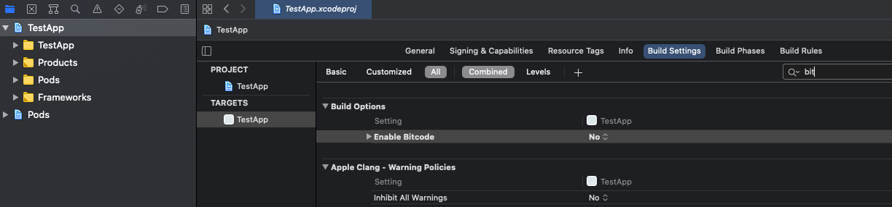
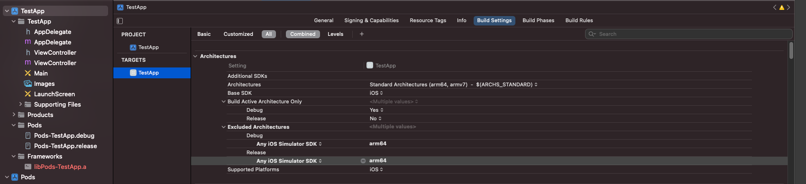

# Ziggeo's Swift SDK

## Index

1. [Why Ziggeo's Swift SDK?](#why-us)
2. [Prerequisites](#prerequisites)
	1. [Download](#download)
	2. [Dependencies](#dependencies)
	3. [Install](#install)
	4. [CocoaPods Support (optional)](#cocoapods-install)
3. [Demo](#demo)
4. [Codes](#codes)
	1. [Init](#init)
	2. [Recorder](#recorder)
		1. [Video Camera Recorder](#video-recorder)
		2. [Video Screen Recorder](#screen-recorder)
		3. [Video Trim](#video-trim)
		4. [Audio Recorder](#audio-recorder)
		5. [Image Capture (Snapshot Recorder)](#image-capture)
		6. [Uploading](#upload-recorder)
	3. [Player](#player)
		1. [Video Player](#video-player)
		2. [Audio Player](#audio-player)
		3. [Image Preview](#image-preview)
	4. [QR Scanner](#qr-scanner)
	5. [Configs](#configs)
		1. [Recorder Config](#recorder-config)
		2. [Player Config](#player-config)
		3. [File Selector Config](#file-selector-config)
		4. [Uploading Config](#uploading-config)
		5. [QR Scanner Config](#qr-scanner-config)
	6. [Events / Callbacks](#events)
		1. [Global Callbacks](#callbacks-global)
		2. [Hardware Permission Callbacks](#callbacks-hardware-permission)
		3. [Uploading Callbacks](#callbacks-uploading)
		4. [File Selector Callbacks](#callbacks-file-selector)
		5. [Recorder Callbacks](#callbacks-recorder)
		6. [Sensor Callbacks](#callbacks-sensor)
		7. [Player Callbacks](#callbacks-player)
		8. [Screen Recorder Callbacks](#callbacks-screen-recorder)
		9. [QR Scanner Callbacks](#callbacks-qr-scanner)
	7. [API](#api)
		1. [Request Cancellation](#api-cancel)
		2. [Videos API](#api-videos)
		3. [Video Streams API](#api-video-streams)
5. [Compiling and Publishing App](#compile)
6. [Update Information](#update)
7. [Changelog](#changelog)


## Why Ziggeo's Swift SDK? <a name="why-us"></a>

Ziggeo is powerfull whitelabel video SAAS that helps people be part and lead the video revolution. It has award winning multimedia API and its CEO and CTO can often be seen talking in various events around the world.

Ziggeo's Swift SDK is utilizing the API to bring you a native library you can add to your project. Just add to project and allow your application evolve into something much more, something video!

It offers you pre-built functionality to call and manipulate. This library also offers you direct access to the Ziggeo API as well if you want to do more things yourself.

### Who it is for?

Do you have a complex iOS app that is missing that one key ingredient - the video?

Do you need a video library that can be seamlesly integrated into your existing app?

Want something that is simple and easy to use?

You need some powerful features high end video apps provide?

Want to provide a great video experience for your own customers?

If any of the above is "Yes" then you are in the right place as this SDK is for you!

### Other Mobile SDKs

Did you know that Ziggeo offers several different SDKs for you to choose from? You can see all of our mobile SDKs [within our docs](https://ziggeo.com/docs/sdks/mobile/).

## Prerequisites <a name="prerequisites"></a>

### Download <a name="download"></a>

You will want to either download the SDK zip file or to pull it in as git repository into your own project.

### Dependencies<a name="dependencies"></a>

Please use latest build tools and sdk version when compiling.
- Add NSPhotoLibraryUsageDescription, NSCameraUsageDescription and NSMicrophoneUsageDescription sections into the info.plist file

```
#import <ZiggeoMediaSwiftSDK/ZiggeoMediaSwiftSDK.h>
```

#### Notification when uploading videos in background

iOS has limitations on time which the app can do various activity in background mode. 
For instance in iOS 14 this time is limited by around 30 seconds.
In case when user moves the current app into background and Ziggeo SDK is still uploading some video(s) then the SDK will show notification asking the user to bring the app to foreground to make sure that videos will be uploaded successfully.
This functionality requires UNNotifications enabled in the app. 

To enable them add the following code in the method `func application(_ application: didFinishLaunchingWithOptions: )` in the `AppDelegate` class:

```
if #available(iOS 10.0, *) {
    let center  = UNUserNotificationCenter.current()
    center.delegate = self
    center.requestAuthorization(options: [.sound, .alert, .badge]) { (granted, error) in
        if error == nil {
            DispatchQueue.main.async(execute: {
                UIApplication.shared.registerForRemoteNotifications()
            })
        }
    }
} else {
    let settings = UIUserNotificationSettings(types: [.sound, .alert, .badge], categories: nil)
    UIApplication.shared.registerUserNotificationSettings(settings)
    UIApplication.shared.registerForRemoteNotifications()
}
```

### Install<a name="install"></a>

iOS Swift SDK offers you several ways to add Ziggeo to your project. The recommended is through CocoaPods

#### CocoaPods Support (optional)

- Install CocoaPods
```
$ sudo gem install cocoapods
```

- Create new iOS project
- Init pods in the xcode project directory

```
$ pod init
```

- Add framework to Podfile
If you are going to be using the SDK flavor with background blurring, you need to set the `ENABLED_BITCODE` option to `No`, otherwise you will not be able to compile your app.
So if your app needs to set the `ENABLED_BITCODE` option to `Yes`, you can not use the SDK flavor with background blurring.
If you don't need to use background blurring, use
```
pod 'ZiggeoMediaSwiftSDK', :git => 'https://github.com/Ziggeo/Swift-Client-SDK.git'
```

If your app does not need to set the `ENABLED_BITCODE` option to `No`, you can use the SDK flavor with background blurring.
If you want to use background blurring, use
```
pod 'ZiggeoMediaSwiftSDK', :git => 'https://github.com/Ziggeo/Swift-Client-SDK.git', :branch => 'blurring'
```

- `ZiggeoMediaSwiftSDK` uses `GoogleAds-IMA-iOS-SDK` for ads. You need to add below commands to `Podfile` for building this sdk.
```
post_install do |installer|
  installer.pods_project.targets.each do |target|
    target.build_configurations.each do |config|
      config.build_settings['IPHONEOS_DEPLOYMENT_TARGET'] = '11.0'
      config.build_settings['EXCLUDED_ARCHS[sdk=iphonesimulator*]'] = 'arm64'
    end
  end
end
```

- Install framework
```
$ pod install
```

- Reopen the project using the .xcworkspace
- If you use the SDK flavor with background blurring, set `ENABLED_BITCODE` to `No` on the *Build Settings* of the project.

- Navigate to `Build Settings` of your project and add `Any iOS Simulator SDK` with value `arm64` inside `Excluded Architectures`.


## Demo<a name="demo"></a>

[This repository](https://github.com/Ziggeo/Swift-Client-SDK) has "samples" directory which would allow you to see how it can be used.

## Codes<a name="codes"></a>

This section will introduce you to the most common ways you would integrate our video library into your app.

### Init<a name="init"></a>

```
import ZiggeoMediaSwiftSDK

var m_ziggeo = Ziggeo(token: "ZIGGEO_APP_TOKEN")
m_ziggeo.qrScannerDelegate = self
m_ziggeo.hardwarePermissionDelegate = self
m_ziggeo.uploadingDelegate = self
m_ziggeo.fileSelectorDelegate = self
m_ziggeo.recorderDelegate = self
m_ziggeo.sensorDelegate = self
m_ziggeo.playerDelegate = self
m_ziggeo.screenRecorderDelegate = self
```
- You can grab your appToken by logging [into your](https://ziggeo.com/signin) account and under application you will use > Overview you will see the app token.

### Send Email To Support<a name="send-email-to-support"></a>

```
m_ziggeo.sendEmailToSupport()
```

### Send Support<a name="send-support"></a>

```
m_ziggeo.sendReport(["LOG_1", "LOG_2", ...])
```

### Recorder<a name="recorder"></a>

Ziggeo supports different media formats and offers multiple recorder options for you.
1. Video Camera Recorder
2. Video Screen Recorder
3. Video Trim
4. Audio Recorder
5. Image Capture (Snapshot Recorder)
6. Uploading

Each will be showcased within its own section bellow.

- See [Configs](#configs) section bellow to see how to configure the recorder with more specific options, instead of using defaults

#### Video (Camera) Recorder<a name="video-recorder"></a>

To have your app capture video content from the camera, all you need is to use the following

```
m_ziggeo.record()
```

#### Video (Screen) Recorder<a name="screen-recorder"></a>

By utilizing the following you will be creating a foreground service for screen recording

```
m_ziggeo.startScreenRecorder(appGroup: "YOUR_APP_GROUP_NAME", preferredExtension: "Preferred_Extension_Name")
```

#### Video Trim<a name="video-trim"></a>

You can trim video from path.

**Trim Video From Path**

```
m_ziggeo.trimVideo("FILE_PATH")
```

#### Audio Recorder<a name="audio-recorder"></a>

Audio Recorder is perfect when you want to capture the content that does not show the face or any imaging, focusing only on the audio aspect of the capture.

```
m_ziggeo.startAudioRecorder()
```

#### Image Capture<a name="image-capture"></a>

```
m_ziggeo.startImageRecorder()
```

#### Uploading <a name="upload-recorder"></a>

Sometimes you might want to upload something instead of showing the recorder. With the above, you can do the same.

**Upload From Path**

```
m_ziggeo.uploadFromPath("FILE_PATH", data:[:])
```

**Upload using File Selector**

```
self.m_ziggeo.startFileSelector()
```

### Player<a name="player"></a>

Capturing different types of media expects support for playback of the same. As such Ziggeo has a player for different type of media you might capture and use within your apps.

Ziggeo provides to following player:
1. Video Player
2. Audio Player
3. Image Preview

Each will be showcased within its own section bellow.

#### Video Player<a name="video-player"></a>

Player can be used to play local videos, videos from other services and of course videos from Ziggeo servers.

**Standard Playback**

```
m_ziggeo.playVideo("VIDEO_TOKEN")
```
```
m_ziggeo.playVideos(["VIDEO_TOKEN_1", "VIDEO_TOKEN_2", ...])
```

**Playback from third-party source**

```
m_ziggeo.playFromUri("VIDEO_URL")
```
```
m_ziggeo.playFromUris(["VIDEO_URL_1", "VIDEO_URL_2", ...])
```

#### Audio Player<a name="audio-player"></a>

```
m_ziggeo.playAudio("AUDIO_TOKEN")
```
```
m_ziggeo.playAudios(["AUDIO_TOKEN_1", "AUDIO_TOKEN_2", ...])
```

#### Audio Player from third-party source<a name="audio-player"></a>

```
m_ziggeo.playAudioFromUri("AUDIO_URL")
```
```
m_ziggeo.playAudioFromUris(["AUDIO_URL_1", "AUDIO_URL_2", ...])
```

#### Image Preview<a name="image-preview"></a>

```
m_ziggeo.showImage("IMAGE_TOKEN")
```
```
m_ziggeo.showImages(["IMAGE_TOKEN_1", "IMAGE_TOKEN_2", ...])
```

#### Image Preview from third-party source<a name="image-preview"></a>

```
m_ziggeo.showImageFromUri("IMAGE_URL")
```
```
m_ziggeo.showImageFromUris(["IMAGE_URL_1", "IMAGE_URL_2", ...])
```


### QR Scanner<a name="qr-scanner"></a>

QR Scanner makes it easy for your code to retrieve data from the captured QR code.

```
m_ziggeo.startQrScanner()
```

### Configs<a name="configs"></a>

Each embeddings (players and recorders) has default config and often a config you can set a bit differently if you wanted to.

This section will show you various options at your disposal.

#### Recorder Config<a name="recorder-config"></a>

For uploading we are utilizing a helper config, while other parameters can be set up as they are needed.

```
let recorderConfig = RecorderConfig()
...
m_ziggeo.setRecorderConfig(recorderConfig)
```

**Set max duration**

The duration of the recording is always set as endless, meaning there is no limit in how long your video or audio recording can be. The value for this is 0.

If you set it up with 30 this would be equal to 30 seconds of recording, after which the recording will be automatically stopped.

- When set, this time will also be used in the elapsed time indicator at the top-right corner.
- Note: Duration is in seconds.

```
recorderConfigsetMaxDuration(0)
```

**Set countdown time**

When camera capture is started, the person might not be ready or might need to adjust the device before they are ready for capture. By default our recorder offers 3 seconds before the actual recording starts.

- Note: If you set it to 0, the person recording themselves might need to turn their phone, flip camera, or to align themselves first before they would actually start so we suggest keeping it somewhere within 2-5 seconds.

```
recorderConfig.setStartDelay(DEFAULT_START_DELAY)
```

**Auto start recorder**

By default the recorder will show an option to start recording process. This is usually the preferred way for most use cases. In some use cases you might prefer that the recorder starts as soon as it is loaded up within the app. In such cases you can set the the following as (true).

- Note: You might also want to check out `setStartDelay` as well.

```
recorderConfig.setShouldAutoStartRecording(true)
```

**Set Pause Mode**

This options allows you to pause and resume audio recording. By default pause mode is false.

```
recorderConfig.setIsPausedMode(true)
```

**Set which camera you prefer**

This option allows you to select which camera should be used for recording. By default the back camera is used, however you can change it with this option.

- Note: You can choose `FACING_BACK` or `FACING_FRONT`

```
recorderConfig.setFacing(FACING_BACK)
```

**Set the quality of recording**

Set the quality that you want to use for your video recording. Usually the higher the quality, the better, however in some specific usecases where quality is not as important you could use this option to change it.

- Note: You can choose `QUALITY_HIGH`, `QUALITY_MEDIUM` and `QUALITY_LOW`.

```
recorderConfig.setVideoQuality(QUALITY_HIGH)
```

**Forbid camera switch during recording**

By default we allow the camera to be switched within the recorder. Sometimes this might not be desirable, and if so you can forbid the ability to switch by setting this to false.

```
recorderConfig.setShouldDisableCameraSwitch(false)
```

**Submit videos immediately**

By default all videos are immediately sent to our servers. This allows them to be processed and to go through all of the workflows that you have set.
In some cases, you might want to show you button to confirm the video before it is sent or any other action you prefer, in which case you can delay this action.

```
recorderConfig.setShouldSendImmediately(true)
```

**Streaming Recording**

Streaming recording mode will upload the video stream during the recording without caching to local file first. Video preview and video re-record are not available in this mode.

```
recorderConfig.setLiveStreaming(true)
```

**Enable Cover Selector Dialog**

This will allow you to change if the cover (Snapshot / Image / Poster) selection is shown or not.

```
recorderConfig.setShouldEnableCoverShot(true)
```

**Set Video Width**

If you want to set the resolution of the video, you would need to specify the aspect ratio of the video. This will help you set the aspect ratio.
- Note: You can choose `DEFAULT_ASPECT_RATIO`, `FALLBACK_ASPECT_RATIO`, `RATIO_16_9`, `RATIO_4_3` and `RATIO_1_1`.

```
recorderConfig.resolution.setAspectRatio(DEFAULT_ASPECT_RATIO)
```

**Set Video Width**

If you want to set the resolution of the video, you would need to specify the width and height of the video. This will help you set the width. Please check `setWidth` as well.

```
recorderConfig.resolution.setWidth(1920)
```

**Set Video Height**

If you want to set the resolution of the video, you would need to specify the width and height of the video. This will help you set the height. Please check `setHeight` as well.

```
recorderConfig.resolution.setHeight(1080)
```

**Set Video Bitrate**

Setting video bitrate allows you to set specific bitrate that you want to have of your video.

- Note: Higher the bitrate, better the quality. The quality in turn will make the end video file be larger as well. Likewise smaller bitrate will result in smaller file footprint, however the visual data will show it.
- Note: bitrate is expressed in bytes

```
recorderConfig.setVideoBitrate(1024 * 1024 * 2)
```

**Set Audio Bitrate**

Setting audio bitrate allows you to set up the quality of the audio captured. Higher the bitrate more data will be captured for single point in time. Lower the bitrate, lowever the quality will be, as well as file size.

- Note: bitrate is expressed in bytes

```
recorderConfig.setAudioBitrate(128 * 1024)
```

**Set Audio Sample Rate**

Setting sample rate allows you to fine tune how many times per second we sample the mic information and save it as audio capture. We suggest leaving at 44100 for audio and 48000 for video if you want to set this manually.

```
recorderConfig.setAudioSampleRate(44100)
```

**Set Blur Mode**

Sets the blur mode for the recorder, blurring out the background behind the person recording themselves. Defalut value is (false).

```
recorderConfig.setBlurMode(true)
```

**Set Extra Arguments**

This can be used to specify effect profiles, video profiles, custom data, tags, etc.

```
recorderConfig.setExtraArgs(["tags": "iOS,Video,Record",
							"client_auth" : "CLIENT_AUTH_TOKEN",
                            "server_auth" : "SERVER_AUTH_TOKEN",
                            "data" : ["foo": "bar"],
                            "effect_profile" : "1234,5678"])
							   
```

##### Extra arguments examples

**Authentication**

Our API is utilizing patent pending authorization token system. It allows you to secure and fine tune what someone can do and for how long.

The following will be needed if you have enabled the authorization tokens in your app.

- Note: This shows you how to add and utilize auth tokens. On client side, the auth tokens should never be created, nor stored permanently. Ideally, you will create the auth tokens within your server and then if you decide, pass that token to the specific client to allow them to do something within certain timeframe. Hardcoding permanent auth tokens would make it possible for anyone to find them and use, regardless of your desired workflow just by inspecting your app code.

Both client and server side auth tokens have equal say in what one can do. The difference is in how they are created.

**Client Auth**

This section helps you set up a client auth token to be used in the requests you send to our servers. The client auth is created on your server without reaching to our servers first. This is ideal for high speed communication.

```
recorderConfig.addExtraArgs(["client_auth" : "CLIENT_AUTH_TOKEN"])
```

**Server Auth**

The following will help you utilize the server side auth tokens. The server side auth tokens are created on your server as well, however they are created by passing the grants object to our server. Our server then sends you a short token that you can use in any of the calls you make, per the grants you specified.

```
recorderConfig.addExtraArgs(["server_auth" : "SERVER_AUTH_TOKEN"])
```

**Working with Custom Data**

Custom data is set with extraArgs and represents a JSON Object as string. This custom-data can be anything that you want to attach to the media you are recording or uploading.

```
recorderConfig.addExtraArgs(["data" : ["foo": @"bar"]])
```

**Applying Effect Profile**

If you would like to add your logo or apply some effect to every video that you record or upload, you will want to use effect profiles. They can be used by specifying the effect profile token or key.

- Note: If you are using effect profile key, please add `_` (underscore) before the name, even if the name has underscore within it (the first underscore is removed to match the key you are specifying).

```
recorderConfig.addExtraArgs(["effect_profile" : "1234,5678"])
```

**Set Video Profile**

Video profiles allow you to create video in various resolutions of interest. For example if you want to upload a 1080p video and want to have its versions available in SD format as well, this would be the way to do it.

You can add the video profile token by adding video profile token or video profile key.

- Note: If you are using video profile key, please add `_` (underscore) before the name, even if the name has underscore within it (the first underscore is removed to match the key you are specifying).

```
recorderConfig.addExtraArgs(["video_profile" : "12345"])
```

- Note: All recorders are using the same config class described above.

#### Player Config<a name="player-config"></a>

**Set Extra Arguments**

This can be used to specify effect profiles, video profiles, custom data, tags, etc.

```
let playerConfig = PlayerConfig()
playerConfig.setExtraArgs([:])
m_ziggeo.setPlayerConfig(playerConfig)
```

**Set Player Cache Config**

If you want to modify the caching config, you should use the PlayerCacheConfig

```
playerConfig.setIsCachingEnabled(true)
```

**Set Ads Url**

If you want to have the player show adds utilizing VAST, you can specify the link to your VAST manifest here. 

```
playerConfig.setAdsUri("ADS_URL")
```

#### File Selector Config<a name="file-selector-config"></a>

**Set Extra Arguments**

This can be used to specify custom data, tags, etc.

```
let fileSelectorConfig = FileSelectorConfig()
fileSelectorConfig.setExtraArgs(["tags" : "iOS,Choose,Media"])
m_ziggeo.setFileSelectorConfig(fileSelectorConfig)
```

**Set Max Duration**

This value allows you to set the maximum duration of the video to be selected. Setting the value to 0 does not limit the maximum duration. Default value is 0.

- Note: Duration is in seconds.

```
fileSelectorConfig.setMaxDuration(0)
```

**Set Min Duration**

This value allows you to set the minimum duration of the video to be selected. Setting the value to 0 does not limit the minimum duration. Default value is 0.

- Note: Duration is in seconds.

```
fileSelectorConfig.setMinDuration(0)
```

**Enable Multiple Selection**

This value allows you to enable or disable mutliple selection. Default value is (true).

```
fileSelectorConfig.setShouldAllowMultipleSelection(true)
```

**Set Media Type**

You can set this value to display only certain types of media. If you do not set this value, all types of media are displayed.

- Note: You can set `VIDEO`, `AUDIO` and `IMAGE`.

```
fileSelectorConfig.setMediaType(VIDEO | AUDIO | IMAGE)
```

#### Uploading Config<a name="uploading-config"></a>

**Set Extra Arguments**

This can be used to specify custom data, tags, etc.

```
let uploadingConfig = UploadingConfig()
uploadingConfig.setExtraArgs(["tags": "iOS,Take,Photo"])
m_ziggeo.setUploadingConfig(uploadingConfig)
```

**Enable Use Only Wifi**

If you set this value to (true), you can only use Wi-Fi.

```
uploadingConfig.setShouldUseWifiOnly(true)
```

**Set Start As Foreground**

If you set this value to (true), you can upload without starting a background service (will start only when the app goes foreground).

```
uploadingConfig.setShouldStartAsForeground(true)
```

**Turn Off Upload**

If you set this value to (true), you can turn off upload.

```
uploadingConfig.setShouldTurnOffUploader(true)
```

#### QR Scanner Config<a name="qr-scanner-config"></a>

**Close After Successful Scan**

Setting this value to (true) allows you to close the QR scanner after a successful scan.

```
let qrScannerConfig = QrScannerConfig()
qrScannerConfig.setShouldCloseAfterSuccessfulScan(true)
m_ziggeo.setQrScannerConfig(qrScannerConfig)
```

### Events / Callbacks<a name="events"></a>

Callbacks allow you to know when something happens. They fire in case of some event happening, such as if error occurs. This way you can design your app to fine detail and be able to provide you customers with great experience.

We have separated the events that are available to you into several different categories.

Before doing that, you will need to register a callback and this is done with the `ZiggeoHardwarePermissionDelegate`, `ZiggeoUploadingDelegate`, `ZiggeoFileSelectorDelegate`, `ZiggeoRecorderDelegate`, `ZiggeoSensorDelegate`, `ZiggeoPlayerDelegate`, `ZiggeoScreenRecorderDelegate`, `ZiggeoQRScannerDelegate`.

```
extension ViewController: ZiggeoHardwarePermissionDelegate, ZiggeoUploadingDelegate, ZiggeoFileSelectorDelegate, ZiggeoRecorderDelegate, ZiggeoSensorDelegate, ZiggeoPlayerDelegate, ZiggeoScreenRecorderDelegate, ZiggeoQRScannerDelegate {
    ...
}
```

#### Global Callbacks<a name="callbacks-global"></a>

* No global callbacks are available at this time

#### Hardware Permission Callbacks<a name="callbacks-hardware-permission"></a>

**Permissions**

Same callback will fire for both Success and Failure, you will need to check the argument passed over to see if access went through (true) or failed (false).

```
func checkCameraPermission(_ granted: Bool) {
	// this method will return when camera access permission is granted or denied.
}

func checkMicrophonePermission(_ granted: Bool) {
	// this method will return when microphone access permission is granted or denied.
}

func checkPhotoLibraryPermission(_ granted: Bool) {
	// this method will return when photo library access permission is granted or denied.
}

```

**Camera availability**

Sometimes you might want to know that there is/are camera(s) available. This callback will fire to let you know if there are cameras or if there are none.

- Note: You will need to check the argument if there is camera detected (true) or not (false).

```
func checkHasCamera(_ hasCamera: Bool) {
	// this method will return whether camera hardware is detected or not.
}
```

**Microphone availability**

Most devices will have microphone available. It could however happen that it is not available, or that it is completely disconnected.

- Note: You will need to check the argument if there is mic detected (true) or not (false).

```
func checkHasMicrophone(_ hasMicrophone: Bool) {
	// this method will return whether microphone hardware is detected or not.
}
```

#### Uploading Callbacks<a name="callbacks-uploading"></a>

**Uploading started**

Want to know when upload starts? In that case you will want to listen to this event. It will be raised every time uploads start to happen.

```
func preparingToUpload(_ path: String) {
	// this method will be called first before any Ziggeo API interaction
}
```

This will be followed by:

```
func uploadStarted(_ path: String, token: String, streamToken: String, backgroundTask: URLSessionTask) {
	// this method will be called on actual file(video, audio, image) upload start after empty file(video, audio, image) creation on Ziggeo platform
}
```

If by some chance it turns out to fail, then other callback would be raised to help detect this:
```
func failedToUpload(_ path: String) {
	// this method will be called when file(video, audio, image) uploading was failed
}
```

**Upload progress**

Do you want to know the progress of the uploads? This event will be continuously raised as the uploaded data changes, allowing you to track the progress of every upload.  

```
func uploadProgress(_ path: String, token: String, streamToken: String, totalBytesSent: Int64, totalBytesExpectedToSend: Int64) {
	// this method will be called while uploading the file(video, audio, image)
}
```

- Note: Please note that during the upload progress you can always stop the upload by calling `cancelUpload` as per following:

```
m_ziggeo.cancelUpload(path, delete_file)
```

**Upload finished**

Want to know once upload finishes? Then you would want to listen to this event. Our SDK will raise it once all uploading is complete.

```
func uploadFinished(_ path:String, token: String, streamToken: String) {
	// this method will be called after the file(video, audio, image) was uploaded
}
```

**Media Verified**

Do you want to know if the media just uploaded can be processed? In most cases this is true, however in rare cases, it might not be possible.

This utilizes our quick check algorithm to inspect the media before it is sent to processing to see that it can actually be processed. This allows you to react if something is wrong with the media, before the processing stages. It also offers you a way to skip the processing stages, since once verified client side code can do anything, even if not related to the media.

```
func uploadVerified(_ path:String, token: String, streamToken: String, response: URLResponse?, error: Error?, json: NSDictionary?) {
	// this method will be called when file(video, audio, image) upload finished successfully or failed
}
```

**Processing**

While we do not offer an insight into how much of the media was processed, we can tell you how long it is going for. This event will be raised for the entire duration of media processing.

```
func uploadProcessing(_ path: String, token: String, streamToken: String) {
	// this method will be called while processing the file(video, audio, image)
}
```

**Processing Finished**

Interested in knowing when the media is successfully processed? Listening for this event will allow you to know just that. As soon as it fires, the media is available for playback

```
func uploadProcessed(_ path: String, token: String, streamToken: String) {
	// this method will be called when uploading the file(video, audio, image) was finished by ziggeo servers
}
```

**Processing Cancelled**
```
func cancelUpload(_ path: String, deleteFile: Bool) {
   // this method will be called when uploading the file(video, audio, image) was cancelled
}
```

```
func cancelCurrentUpload(_ deleteFile: Bool) {
	// this method will be called when uploading current file(video, audio, image) was cancelled
}
```

#### File Selector Callbacks<a name="callbacks-file-selector"></a>

**Uploading cancelled**

```
func uploadCancelledByUser() {
	// this method will be called when user call the cancelUpload function.    
}
```

**Uploading selected**

```
func uploadSelected(_ paths: [String]) {
    // this method will be called when user select the files for uploading.
}
```

#### Recorder Callbacks<a name="callbacks-recorder"></a>

The callbacks in this section are specific to recorder only. This means that they will not fire at all for the player embeds.

The callbacks are listed in the order that they should appear in within your code.

- Note: Some callbacks might not be called. For example if video is uploaded and not recorded, recording specific callbacks will never fire.

**Ready to record**

In most cases, once permissions are given, the recording can start and as such this callback will fire. It means that camera is ready and that all permissions are granted. All that is left is to start recording.

```
func recorderReady() {
	// this method will be called when recorder is ready to recorder
}
```

**Recording has started**

This event fires once recording has just started. This is useful if you want to know that the video was recording and not upload since upload events will fire for all.

It can also be useful if you are using embedded recorder and you want to stop all other activities and bring more focus to the capture.

Standard Recording

```
func recorderStarted() {
	// this method will be called when recorder is started
}
```

Streaming Recording

```
func streamingStarted() {
	// Triggered when a streaming process has started (Press on the Record button if countdown 0 or after the countdown goes to 0)
}
```

- Note: Streaming is when recording is sent to Ziggeo servers as soon as recording happens. You need to turn this feature on to be utilized.

**Recording in progress**

This event is raised when recording is in process. This is a continuous update notification that will fire through entire duration of recording process.

- Note: `seconds` parameter will let you know how much time has passed since the recording had started.

```
func recorderCurrentRecordedDurationSeconds(_ seconds: Double) {
	// this method will be called while recording
}
```

**Recording cancelled**

Want to detect if someone cancels the recording? Use this event to know when someone cancelled the recording and closed the screen.

```
func recorderCancelledByUser() {
	// this method will be called when video recorder is canceled
}
```

**Recording Finished**

This event will be raised when recording had just finished. It will happen in cases when the end user clicks on Stop button as well as if there was duration or size limit that was reached.

Standard recording

```
func recorderStopped(_ path: String) {
	// this method will be called when recorder is stopped
}
```

Streaming Recording

```
func streamingStopped() {
	// Triggered when a streaming process has stopped (automatically after reaching the maximum duration or manually.)
}
```

**Confirm Recording**

Need to make sure someone confirms the video submission? Use this callback and record its action on your side as you like.

As this might be a requirement in some countries you are utilizing your app, you can easily use this for any sort of confirmation of captured video.

- Note: Our code only fires this event. It is up to you to then use this event to capture and save that someone confirmed the use of the video and in what way. This is done so as it offers you most flexibility in what you want to do and how.

```
func recorderManuallySubmitted() {
	// this method will be called when recorded file(video or audio) is uploaded by the user
}
```

**Re-Recording**

Rerecording is a common way to provide the end user of capturing multiple samples before they have one that they are satisfied with to submit.

```
func recorderRerecord() {
	// this method will be called when recorder is rerecorded
}
```

**Play Recorded Video**

```
func recorderPlaying() {
	// this method will be called when recorder plays the recorded media
}
```

**Pause Recorded Video**

```
func recorderPaused() {
	// this method will be called when recorder pauses the playback of recorded media
}
```

#### Sensor Callbacks<a name="callbacks-sensor"></a>

**Face Detected**

When face is detected on the video and if you are listening to the callback you will get information about the face. Please note that the face detection will not recognize who someone is, rather just a simple way of knowing that there is a face over the video.

- Note: If the same person leaves the video and comes back, they will have a different face ID even if it is the same person.

```
func faceDetected(_ faceID: Int, rect: CGRect) {
	// this method will be called when face is detected
}
```

**Lightning conditions**

Want to know lightning conditions? Our light sensor even will be raised every second to provide you with a value of how light / dark the environment seems.

- Note: Our SDK is checking {@link Sensor.TYPE_LIGHT} value

```
func recorderLuxMeter(_ luminousity: Double) {
	//
}
```

**Microphone levels**

Are you interested in knowing microphone health status? This event will be raised every second with the information about the recorder amplitude.

```
func audioMeter(_ audioLevel: Double) {
	//Your code goes here
}
```

#### Player Callbacks<a name="callbacks-player"></a>

We differentiate between player and the player shown automatically immediately after recording. You will find events for both types here.

**Media playback available**

Want to know once the player can play the video? This event will let you know once the media is available for playback. By listening to it, you can avoid listening to progress events as it will fire once the media is ready regardless if it has to be processed first, or if it is waiting to download the media to make it available for playback

```
func playerReadyToPlay() {
	// Triggered when a video player is ready to play a video
}
```

**Playback started**

Want to react when playback is started? This event will be raised every time the playback is started.

```
func playerPlaying() {
	// Fires any time a playback is started
}
```

**Playback paused**

What to react when someone pause's the video?. This event will be raised when the Pause button is clicked.

- Note: It will also fire at the end of the video

```
func playerPaused() {
	// Fires when the pause button is clicked (and at the end of the video)
}
```

**Playback Ended**

Want to know when the media playback ends? This event will be raised any time the playback reaches the end of media length.

```
func playerEnded() {
	// Fires when a video playback has ended (reaches the end)
}
```

**Playback Cancelled**

This method will be called when user touch close button.

```
func playerCancelledByUser() {
	// Fires when user close player
}
```

**Playback seeking**

Want to know if and where to someone changes the point of playback (seeks the media)? This event will be raised when the person watching the media moves the player's progress indicator to a new position. This will fire for both going forward as well as going back in playback.

- Note: The value returned will be milliseconds of time when seek operation was set to, looking from the start.

```
func playerSeek(_ positionMillis: Double) {
	// Triggered when the user moves the progress indicator to continue video playback from a different position
}
```

#### Screen Recorder Callbacks<a name="callbacks-screen-recorder"></a>


#### QR Scanner Callbacks<a name="callbacks-qr-scanner"></a>

**QR Code Scan scanned**

```
func qrCodeScaned(_ qrCode: String) {
	// this method will ba called when qr code was detected. 
}
```

**QR Code Scan cancelled**

```
func qrCodeScanCancelledByUser() {
	// this method will be called when qr code Scan is canceled
}
```

### API<a name="api"></a>

The SDK provides an opportunity to make custom requests to Ziggeo Embedded Server API. You can make POST/GET/custom_method requests and receive RAW data, json-dictionary or string as the result.

You will first need to get API Accessor Object

```
let connection = self.application.connect
```

#### Make POST Request and Parse JSON Response

```
connection.postJsonWithPath(path, data: NSDictionary?, callback: { (jsonObject, response, error) in
	//jsonObject contains parsed json response received from Ziggeo API Server
})
```

#### Make POST Request and Get RAW Data Response

```
connection.postWithPath(path: String, data: NSDictionary?, callback: { (data, response, error) in
	//data contains RAW data received from Ziggeo API Server
})
```

#### Make GET Request and Get String Response

```
connection.getStringWithPath(path: String, data: NSDictionary?, callback: { (string, response, error) in
	//the string contains stringified response received from Ziggeo API Server
})
```

#### Request Cancellation<a name="api-cancel"></a>

* This is not available in our Swift SDK at this time

#### Videos API<a name="api-videos"></a>

* This is not available in our iOS SDK at this time

#### Video Streams API<a name="api-video-streams"></a>

* This is not available in our iOS SDK at this time


## Compiling and Publishing App<a name="compile"></a>

### Building/Packaging App

- Grab framework from Swift-Client-SDK/Output/ directory. Use Swift 3.2 version for Xcode 9.0+, Swift 3.1 version for Xcode 8.3+ and Swift 3 for older Xcode versions
- Clean and rebuild the application

### Preparing App for submission to App Store

- Create "new run script phase" at the application target build settings to strip the unused architectures. Use the script provided with the Swift-Client-SDK/TestApplication example (TestApplication target settings -> Build phases -> Run script section)

## Update Information<a name="update"></a>

Note: Starting with 1.1.22 this SDK requires Swift 5.3.1 compiler due to Swift compiler limitation. If you want to use Swift 5.3 or below you should use ZiggeoMediaSwiftSDK 1.1.21 or older.

## Changelog<a name="Changelog"></a>

If you are interested in our changelog you can find it as a separate file next to this readme. It is named as [CHANGELOG.md](CHANGELOG.md)
